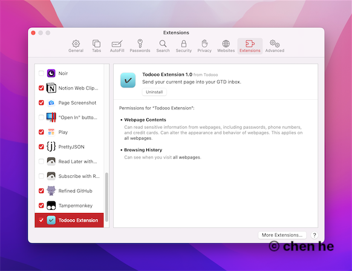

# Todooo

Todooo is a simple Safari Extension to enhance your Todo applications, which include Omnifocus, Things3.

### 1. Open Todooo, Click to activate safari preference panel.

### 2. Checked Todooo extension.

### 3. Use it.

#### 3.1 Omnifocus

#### 3.2 Things

## Credits

[ITSwitch](https://github.com/iluuu1994/ITSwitch)
